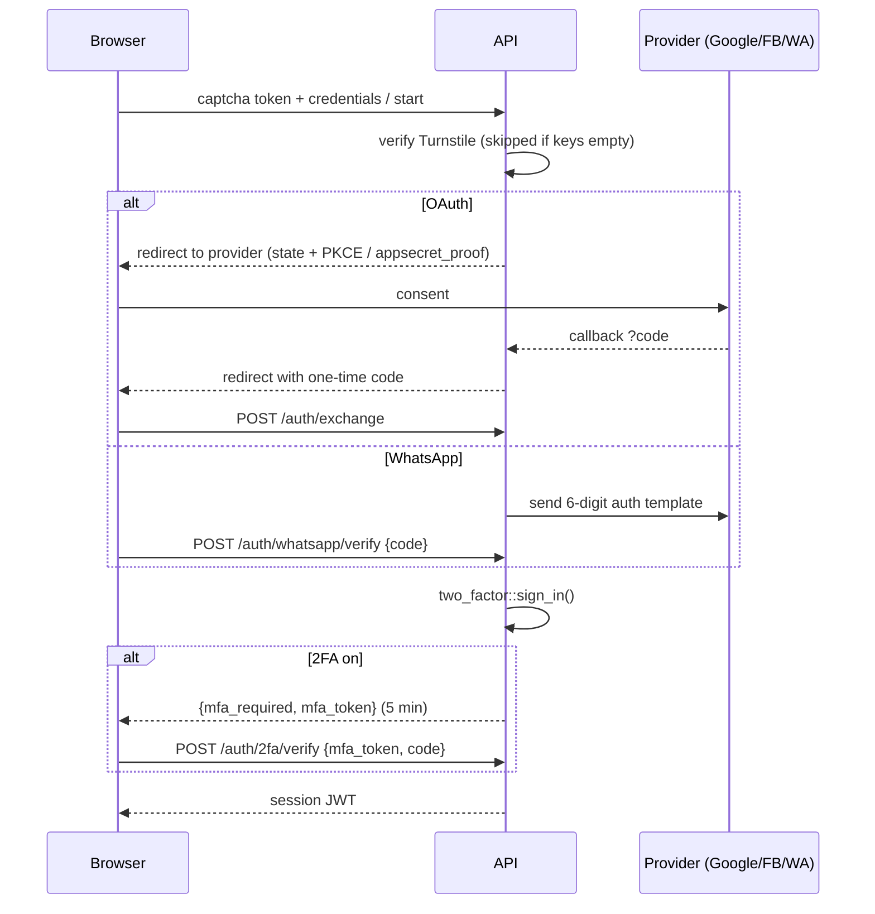
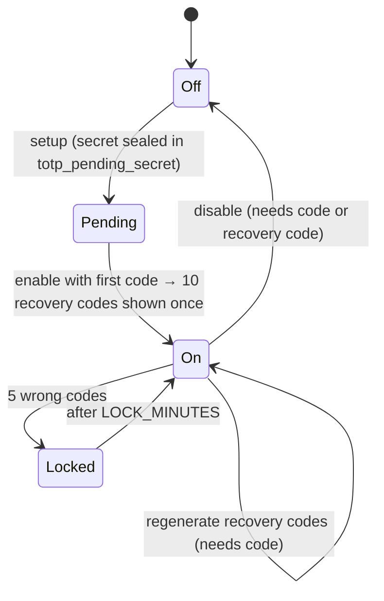

# 01 · Accounts & sign-in

**Where:** `backend/crates/platform/src/{auth_routes,oauth,two_factor,totp,captcha}.rs` · migrations `0007_social_login`, `0012_two_factor` · pages `/login`, `/register`, `/auth/callback`, `/auth/two-factor`, `/account`.

## Actors
Visitor · signed-in user · Google / Facebook / WhatsApp Cloud API · Cloudflare Turnstile.

## Entry points
| Action | API |
|---|---|
| Register / login (email or `+phone`) | `POST /auth/register` · `POST /auth/login` |
| Which methods are configured | `GET /auth/providers` |
| Google / Facebook | `POST /auth/oauth/{p}/start` → `GET /auth/oauth/{p}/callback` → `POST /auth/exchange` |
| WhatsApp code | `POST /auth/whatsapp/send` → `POST /auth/whatsapp/verify` |
| 2FA | `GET /auth/2fa` · `POST /auth/2fa/setup` · `/enable` · `/verify` · `/disable` · `/recovery-codes` |
| Manage methods | `GET /auth/identities` · `DELETE /auth/identities/{p}` · `POST /auth/password` |

## Sign-in flow (every method)

## Flow
1. Visitor picks a method shown by `/auth/providers` (only configured ones appear).
2. Turnstile token is checked for sign-in, sign-up and WhatsApp code requests.
3. First factor passes → `sign_in()` either issues the JWT or a 2FA challenge (`mfa_challenges`, 5 minutes).
4. Second factor: authenticator code or one unused recovery code.
5. Admin role is granted at registration/startup if the email is in `ADMIN_EMAILS`.

## 2FA lifecycle

## Rules
- OAuth tokens never appear in URLs — the browser only gets a one-time code for `/auth/exchange`.
- Google with verified email **joins** the existing account with that email. Facebook email matching an existing account is **refused** → user must sign in and connect Facebook from `/account` (prevents takeover).
- WhatsApp codes: hashed, 10-minute expiry, 5 attempts, 1/min and 5/hour per number.
- The last usable sign-in method can't be removed.
- TOTP secrets are AES-GCM sealed with `KYC_ENCRYPTION_KEY`; `totp_last_step` blocks replay; only hashes of recovery codes are stored.
- Linking a method while signed in never triggers a 2FA challenge.

## Config
`JWT_SECRET`, `GOOGLE_CLIENT_ID/SECRET`, `FACEBOOK_APP_ID/SECRET`, `WHATSAPP_TOKEN`, `WHATSAPP_PHONE_NUMBER_ID`, `WHATSAPP_OTP_TEMPLATE`, `OTP_RESEND_SECONDS`, `OTP_DEV_ECHO`, `TURNSTILE_SITE_KEY`/`TURNSTILE_SECRET_KEY`, `ADMIN_EMAILS`, `KYC_ENCRYPTION_KEY`.

## Test
`python scripts/oauth_test.py` (mock providers; env listed at the top of the script).
