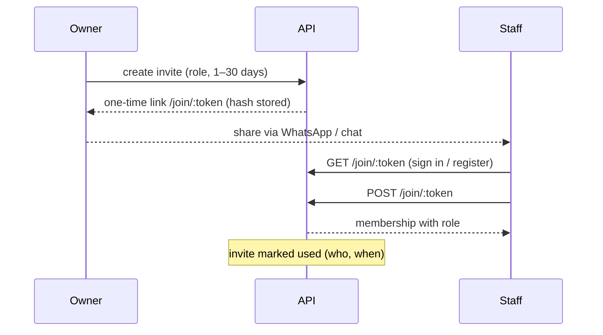
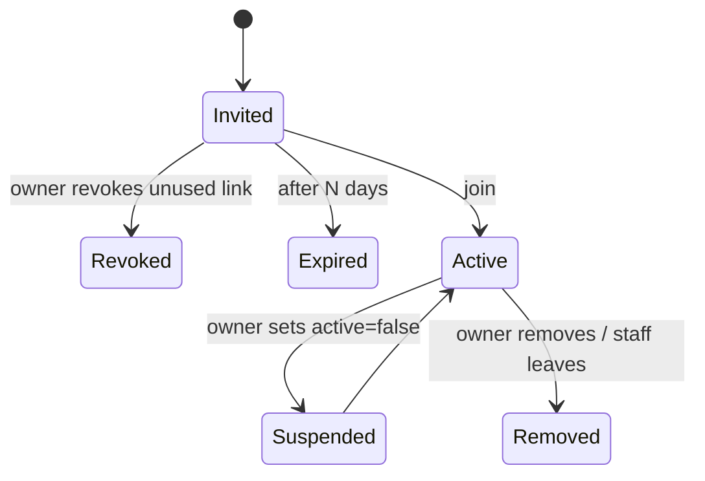

# 02 · Shops, onboarding & staff

**Where:** `platform/src/{shops,staff}.rs`, `kernel/src/access.rs` · migration `0015_staff_pos_bills` · pages `/dashboard` (first-run onboarding), `/dashboard/settings`, `/dashboard/staff`, `/join/:token`.

## Actors
Owner · staff member · invitee.

## Entry points
| Action | API |
|---|---|
| Create / edit shop | `POST /shops` · `PATCH /shops/:id {entity_type, vertical, …}` |
| My shops (owned + member, with `access`) | `GET /me/shops` |
| Roles | `GET /shops/:id/staff` · `POST /shops/:id/staff/roles` · `PATCH\|DELETE /shop-roles/:id` |
| Invites | `POST /shops/:id/staff/invites {role_id, note, days}` · `DELETE /staff-invites/:id` |
| Join | `GET\|POST /join/:token` |
| Member changes | `PATCH\|DELETE /shops/:id/staff/:user_id {role_id?, active?}` · `DELETE /me/memberships/:shop_id` |

## Onboarding flow
1. Signed-in user creates a shop: name, slug, currency (THB/LAK/USD), `kind` (`seller` / `creator`), `entity_type` (`individual` / `business`), `vertical` / core choice (general, vehicle, restaurant, insurance …) from `CoreDef` onboarding options.
2. Shop gets the five default roles: *Manager, Cashier, Stock keeper, Orders & delivery, Marketing* (Lao names if owner uses Lao).
3. Business shop → must pass [KYB](03-kyb.md) before publishing.
4. Owner fills Shop settings: storefront, tax ID, receipt prefixes, VAT mode.

## Staff invite flow

## Membership states

## Rules
- Permissions: `stats, products, inventory, media, orders, delivery, pos, pos_void, social, leads, marketing, network, settings`.
- Always owner-only: staff management, business verification, changing shop type.
- Server enforcement: a route layer maps the matched route → permission (task-local); `owned_shop()` lets staff through only if their role has it. Unmapped routes are owner-only (safe by default).
- Cores add rows via `CoreModule.access_rules`; layers add dashboard pages via `CoreDef.pages`.
- Dashboard sends staff to the first page they can open (cashier → `/pos`). Actions record the acting user.
- A business shop in review or verified can't switch itself back to individual.

## Test
`python scripts/staff_test.py`.
