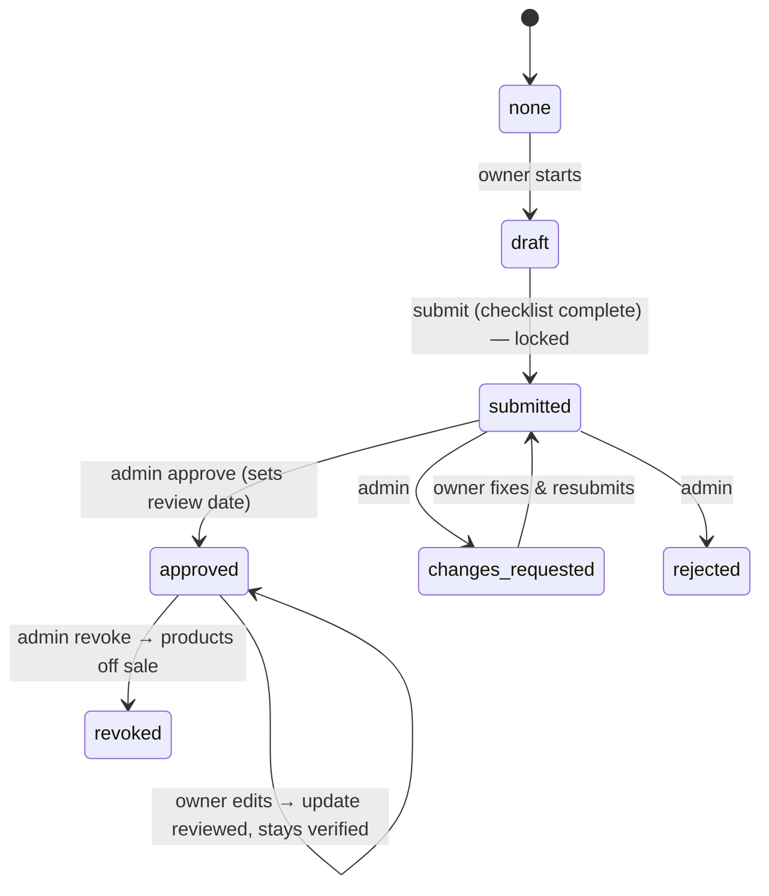

# 03 · Business verification (KYB / corporate KYC)

**Where:** `platform/src/kyb.rs` · migration `0011_kyb` · pages `/dashboard/verification`, `/admin/kyb`, `/admin/kyb/:shop_id`.

## Actors
Business-shop owner · platform admin.

## Entry points
| Action | API |
|---|---|
| Read / save draft | `GET\|PUT /shops/:id/kyb` |
| Upload / delete document | `POST /shops/:id/kyb/documents` (multipart `kind, file, expires_on`) · `DELETE /kyb/documents/:id` |
| View file (owner/admin) | `GET /kyb/documents/:id/file` |
| Submit | `POST /shops/:id/kyb/submit` |
| Admin queue / detail / decide | `GET /admin/kyb?status=&q=` · `GET /admin/kyb/:shop_id` · `POST /admin/kyb/:shop_id/decision {action, note, documents}` |

## States (`shops.kyb_status`)

Document status: `pending → accepted | rejected` (per document, with reason).

## Flow
1. Owner sets `entity_type = business` (onboarding or settings).
2. Fills company: type (Lao enterprise forms), names EN/LO, registration no. & date, tax ID, address, activity, contacts.
3. Adds people: 1 legal representative, directors, beneficial owners ≥25% (ownership %, ID, nationality, DOB, PEP flag) + payout bank account.
4. Uploads documents; the live checklist shows what's missing:
   - Required: registration certificate, tax certificate, representative ID.
   - Shareholder register for limited/public/sole companies and partnerships.
   - Authorisation letter when representative isn't a director.
   - Optional: licence, articles, proof of address, bank proof, other.
5. Submit → record locks.
6. Admin works `/admin/kyb` with risk flags: PEP, duplicate registration no., foreign rep/owner, docs expiring ≤30 days, <25% ownership declared.
7. Admin accepts/rejects each document, then approve / request changes / reject / revoke with a note.
8. Approved → **Verified business** badge; review date = now + `KYB_REVIEW_MONTHS`.
9. Revoked → `ShopHook` fires → commerce pauses the shop's products.

## Rules
- Files: JPG/PNG/WebP/PDF ≤10 MB, sniffed by content; expired/rejected docs don't count.
- ID & bank numbers AES-256-GCM encrypted; owner sees last 4 only; admin "show" toggle.
- Documents live in private storage (`PRIVATE_DIR` or `KYC_S3_BUCKET` / `private/`), served only through the file endpoint with `no-store` + sandbox CSP.
- Every admin view is logged in `kyb_events`.
- `KYB_REQUIRED_TO_PUBLISH` (default on) blocks publishing for unverified business shops; drafts always allowed.

## Config
`KYC_ENCRYPTION_KEY` (**back up separately**), `PRIVATE_DIR` / `KYC_S3_BUCKET`, `KYB_REQUIRED_TO_PUBLISH`, `KYB_REVIEW_MONTHS`.

## Test
`python scripts/kyb_test.py`.
