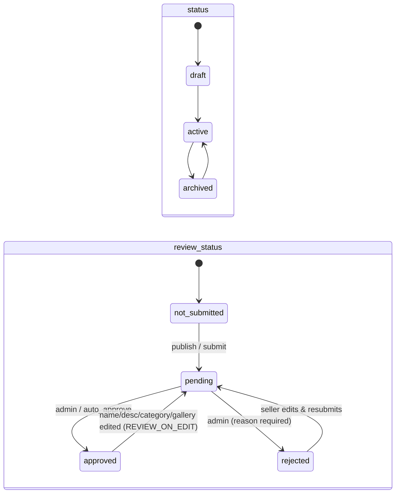

# 04 · Products, categories, review & inventory

**Where:** `commerce/src/routes/{products,categories,review,inventory,barcodes}.rs` · migrations `0001`, `0003_categories_review` · pages `/dashboard/products` (`/new`, `/:id`), `/dashboard/categories`, `/dashboard/inventory`, `/admin` + `/admin/products/:id` (review), `/admin/categories`, `/admin/shops`.

## Actors
Seller (perm `products` / `inventory`) · admin · shopper.

## Entry points
| Action | API |
|---|---|
| CRUD | `GET\|POST /shops/:id/products` · `GET\|PATCH\|DELETE /products/:id` |
| Submit for review / history | `POST /products/:id/submit` · `GET /products/:id/reviews` |
| Admin review | `GET /admin/products?review_status=` · `POST /admin/products/:id/review {approve\|reject, note}` · `POST /admin/products/review` (bulk) |
| Trusted shop | `PATCH /admin/shops/:id {auto_approve}` |
| Marketplace categories | `GET /catalog/categories` · `GET\|POST /admin/categories` |
| Shop categories | `GET\|POST /shops/:id/categories` · `PATCH\|DELETE /categories/:id[?reassign_to=]` · `POST /categories/reorder` |
| Stock | `POST /products/:id/stock` · `GET /shops/:id/inventory/movements` · `GET /shops/:id/inventory/low-stock` |

## States
Two independent fields — shoppers see a product only when **`status = active` AND `review_status = approved`**.

## Flow
1. Seller creates a draft: name, description, price, stock, SKU/barcode, marketplace category (required to publish), optional shop category, gallery ([05](05-media.md)), resale settings ([06](06-sell-staff.md)).
2. Publish (`status=active` or `/submit`) → checks: marketplace category set; business shop KYB-verified if `KYB_REQUIRED_TO_PUBLISH`.
3. Review: trusted shop (`auto_approve`) or `PRODUCT_REVIEW=off` → approved immediately; otherwise queued at `/admin`.
4. Admin approves/rejects (single or bulk); rejection note visible to seller. Each step → `product_reviews`.
5. Live edits: name, description, marketplace category, gallery → back to `pending`. Price, stock, commission stay live.
6. Inventory: restock/adjust via `/stock`; sales, returns, cancels and social reservations write movements automatically. Low-stock alert per product threshold.

## Categories
- **Marketplace tree** (admin, ≤3 levels): starter set from migration; hide, or reassign products before delete. Category page includes all descendants.
- **Shop tree** (seller, ≤3 levels): add/rename/reorder/move/hide/delete; sidebar filter on `/s/:slug`.

## Rules
- The visibility rule (active + approved) applies to catalog, storefront, checkout, ads, creator feed and resale listings.
- `stock` only changes inside transactions with a movement row and reason.
- KYB revoked → products paused via `ShopHook`.

## Config
`PRODUCT_REVIEW` (on/off), `REVIEW_ON_EDIT`, `KYB_REQUIRED_TO_PUBLISH`.

## Test
`python scripts/review_test.py` · `python scripts/smoke_test.py`.
