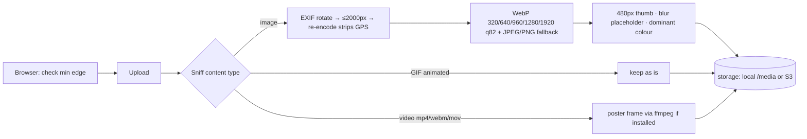

# 05 · Media library

**Where:** `commerce/src/routes/media.rs`, `kernel/src/{media,storage}.rs` · migrations `0002_media`, `0009_media_variants` · pages `/dashboard/media`, product form gallery · component `AppImage`.

## Actors
Seller (perm `media`) · admin (backfill) · shopper (consumes images).

## Entry points
| Action | API |
|---|---|
| List / upload | `GET /shops/:id/media` · `POST /shops/:id/media/upload[?product_id=]` (multipart `file`) |
| Import by URL | `POST /shops/:id/media/url` |
| Edit / delete | `GET\|PATCH\|DELETE /media/:id[?force=true]` · `POST /shops/:id/media/delete` (bulk) |
| Product gallery | `GET\|PUT /products/:id/media` (`PUT {asset_ids}` = full ordered gallery) |
| Backfill variants | `POST /admin/media/backfill` |

## Upload pipeline

## Flow
1. Seller uploads once (browser rejects images below `MEDIA_MIN_IMAGE_EDGE`; API enforces too).
2. Asset lands in the shop library; reusable in product galleries, creator posts and ads.
3. Gallery: up to 15 items, reorderable; first = cover → `products.cover` (with variants) and `products.images` stay in sync.
4. Product page / cards render via `AppImage` (`<picture>`, `srcset`, lazy, blur placeholder; main image eager + `fetchpriority=high`).
5. Delete: blocked with 409 if still used, unless `force` → removed from every product/post/ad.
6. On API start a background job generates missing variants for old uploads.

## Rules
- Type is checked by bytes, not filename.
- Images processed with one job per CPU core; files in one upload processed in parallel.
- Tiles <1000px show "Low res"; 1200×1200+ recommended.
- Changing a live product's gallery sends it back to review ([04](04-products.md)).

## Config
`MEDIA_DRIVER=local|s3`, `MEDIA_DIR`, `MEDIA_PUBLIC_URL`, `MEDIA_MAX_IMAGE_MB`, `MEDIA_MAX_VIDEO_MB`, S3 vars, `MEDIA_MIN_IMAGE_EDGE` (500).

## Test
`python scripts/media_test.py`.
