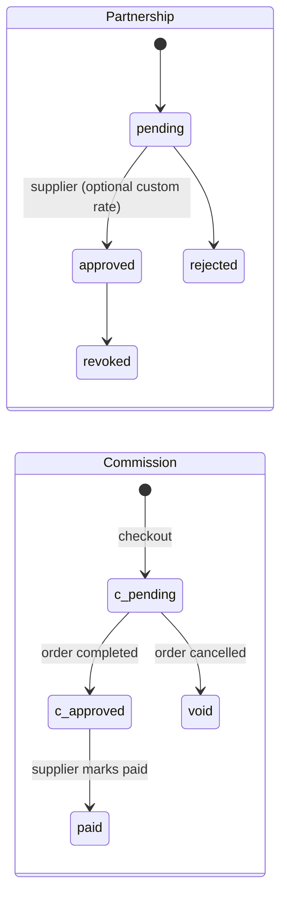

# 06 · Sell-staff network & commissions

**Where:** `commerce/src/routes/partners.rs`, commission writes in `orders.rs` · pages `/dashboard/marketplace`, `/dashboard/partners`, `/dashboard/commissions`, storefront `/s/:slug`.

## Actors
Supplier shop · reseller shop (creator or other seller) · shopper.

## Entry points
| Action | API |
|---|---|
| Browse resellable products | `GET /marketplace/products` |
| Partnerships | `GET\|POST /shops/:id/partnerships` · `POST /partnerships/:id/decision` · `POST /partnerships/:id/revoke` |
| Listings | `GET\|POST /shops/:id/listings` · `DELETE /listings/:id` |
| Commissions | `GET /shops/:id/commissions` · `GET /shops/:id/commissions/payable` · `POST /commissions/:id/pay` |

## States

## Flow
1. Supplier enables `allow_resell` on a product and sets default `commission_bps`.
2. Reseller browses `/dashboard/marketplace`, requests a partnership with the supplier shop.
3. Supplier approves (optionally a custom rate for that reseller) or rejects.
4. Reseller adds listings to its storefront.
5. Shopper buys via `/p/:id?via=<reseller_shop_id>` → checkout ([07](07-orders.md)) creates one order per supplier and a `pending` commission per line.
6. Order `completed` → commission `approved` → supplier pays and marks `paid`.
7. Order cancelled → stock returned, commission `void`.

## Rules
- No self-commission: reseller buying through its own storefront earns nothing.
- Only products active + approved + `allow_resell` appear in marketplace and listings.
- Revoking a partnership stops future commissions; existing ones follow their order.
- Vehicle brokers use the same mechanism; buyer requests go to the broker ([16](16-vehicle.md)).
- Permission: `network`.
