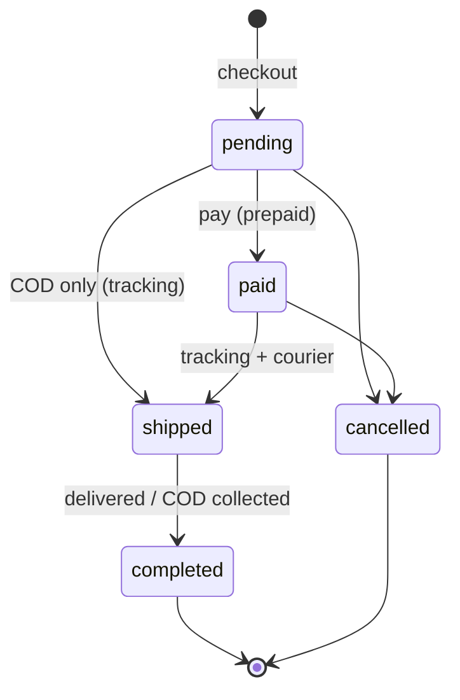

# 07 · Cart, checkout & orders

**Where:** `commerce/src/routes/orders.rs` (+ module checkout hooks) · pages `/p/:id`, `/cart` (checkout inline), `/orders`, `/dashboard/orders`, `/print/order/:id`.

## Actors
Buyer (signed in) · seller/supplier (perm `orders`) · reseller (via commission).

## Entry points
| Action | API |
|---|---|
| Checkout | `POST /orders/checkout` (items, shipping choice, payment method, `promo`, `points`) |
| Buyer orders | `GET /orders` · `GET /orders/:id` · `POST /orders/:id/pay` (mock) · `POST /orders/:id/cancel` |
| Seller sales | `GET /shops/:id/sales?role=supplier\|seller` · `POST /shops/:id/orders/:order_id/status` |
| Printable | `GET /orders/:id/document` · `/print/order/:id?type=invoice\|packing` |

## States


## Checkout sequence
```mermaid
sequenceDiagram
  participant B as Buyer
  participant API
  participant DB
  B->>API: POST /orders/checkout
  API->>DB: BEGIN; SELECT products FOR UPDATE
  API->>API: visibility, stock, vehicle buy-online, COD risk, promo quote
  API->>DB: one order per supplier shop (+shipping, COD fee)
  API->>DB: stock − qty, movement 'sale'
  API->>DB: commission 'pending' if via reseller
  API->>DB: promo redemptions / points
  API->>DB: COMMIT
  API-->>B: orders
```

## Flow
1. Buyer adds items (cart may span shops); per shop chooses courier, branch/home, Pay now or COD ([08](08-delivery-cod.md)); applies codes/points ([15](15-promo.md)).
2. Checkout locks rows, reserves stock, splits into one order per supplier. `grand_total_cents` = items + shipping (if charged at checkout) + COD fee.
3. Prepaid: buyer pays (`/pay` is a mock — replace with PSP webhook). COD: ships unpaid.
4. Seller moves status: paid → shipped (courier + tracking) → completed.
5. Completion → commission approved, loyalty points earned, first-order campaign triggers.
6. Cancel (pending/paid) → stock back (movement `cancel`), commission void, coupon/points reversed, vehicle back to available.

## Rules
- Allowed transitions: `paid→shipped`, `shipped→completed`, `pending|paid→cancelled`, and `pending→shipped` only for COD.
- COD refused for phones at/above `COD_RISK_BLOCK_COD_AT` ([13](13-cod-risk.md)).
- Vehicles are refused unless `allow buy online` and available.
- Completed/paid/shipped orders feed `TaxSource` for finance ([19](19-finance-tax.md)).
