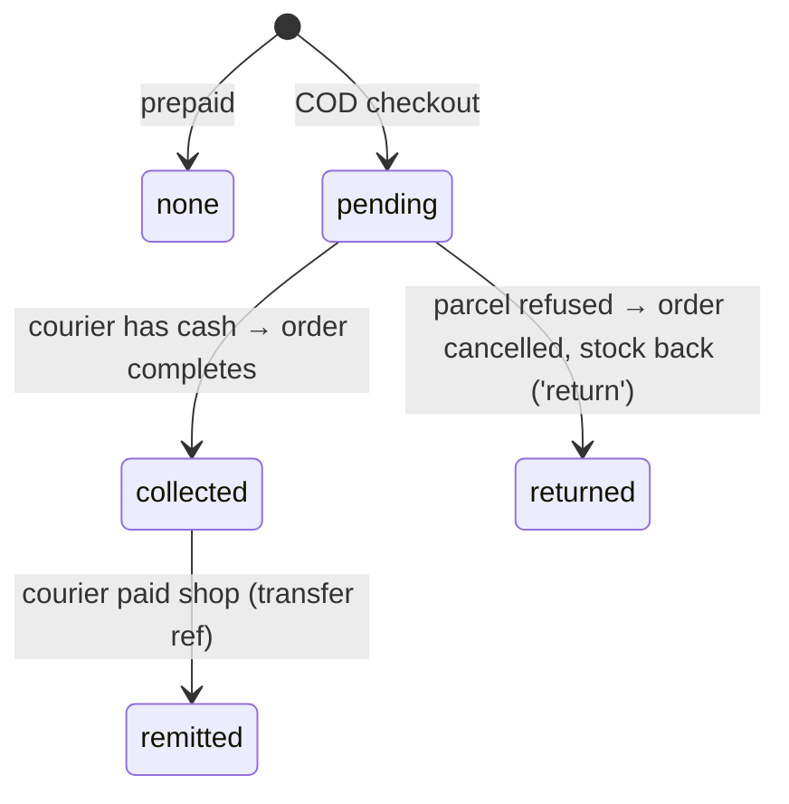

# 08 · Delivery & cash-on-delivery ledger

**Where:** `commerce/src/routes/logistics.rs` · migration `0008_logistics` · pages `/dashboard/shipping`, `/dashboard/cod`, `/admin/carriers`, `/print/label/{order|social}/:id`.

## Actors
Seller (perm `delivery`) · buyer · courier (offline — Anousith, HAL, Mixay, shop delivery) · admin.

## Entry points
| Action | API |
|---|---|
| Couriers | `GET /carriers` · `GET\|POST /admin/carriers` · `PATCH /admin/carriers/{code}` |
| Shop shipping rules | `GET /shops/{id}/shipping` · `PUT /shops/{id}/shipping/{carrier}` |
| Options at checkout | `GET /shipping/options?shops=` |
| COD ledger | `GET /shops/{id}/cod` · `POST /shops/{id}/cod/update` |

## COD states (`cod_status`, on orders and social orders)

## Flow
1. **Setup** (`/dashboard/shipping`), per courier: fee, `fee_payer` (`buyer` at checkout · `destination` paid at pickup / ປາຍທາງ · `seller` free), home delivery + fee, free-over amount, COD on/off + COD fee.
2. **Checkout** (cart or `/c/:token`): buyer picks courier, branch vs home, Pay now vs COD.
3. **Ship**: seller drops parcel at courier, enters tracking no. (no courier booking API); prints A6 label with COD amount.
4. **Track**: tracking link built from carrier template `{tracking}`.
5. **Reconcile** at `/dashboard/cod`: mark collected → remitted (reference) or returned.
6. Returned parcels can be reported to [COD risk](13-cod-risk.md) within the window.

## Rules
- `cod_amount_cents = grand_total_cents` for COD orders.
- Returned → order cancelled, stock returned, promo/points reversed.
- Status messages to chat customers on shipped/delivered/cancelled ([09](09-social.md)).

## Test
`python scripts/logistics_test.py` (API with `ADMIN_EMAILS=admin@demo.dev`).
