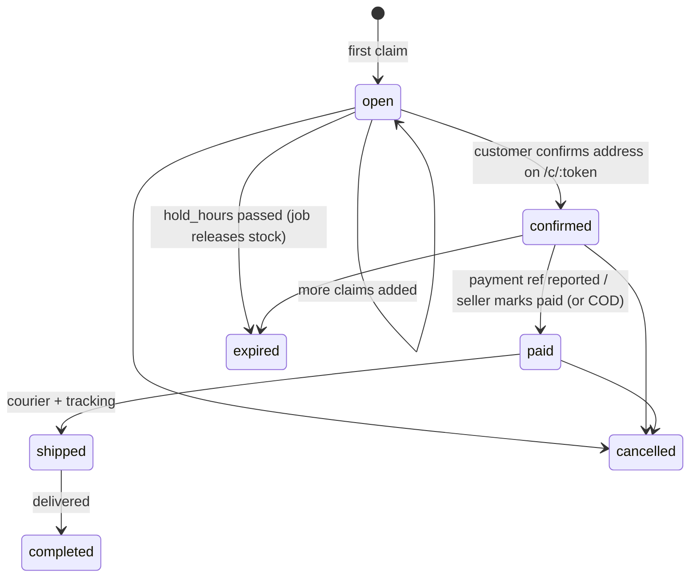

# 09 · Social selling (comment → order)

**Where:** `commerce/src/routes/{social,webhooks}.rs`, `commerce/src/social_parser.rs` · migrations `0005_social`, `0006_lao_social` · pages `/dashboard/social` (live board), `/dashboard/social/{settings,channels,orders}`, public `/c/:token`.

## Actors
Seller (perm `social`) · customer on Facebook / TikTok / WhatsApp / Messenger · Meta & TikTok webhooks · n8n/Make/Zapier/LINE via ingest.

## Entry points
| Action | API |
|---|---|
| Settings & channels | `GET\|PATCH /shops/:id/social/settings` · `GET\|POST /shops/:id/social/channels` · `PATCH\|DELETE /social/channels/:id` |
| Live sessions | `GET\|POST /shops/:id/social/sessions` · `POST /social/sessions/:id/end` · `GET /shops/:id/social/feed\|board` |
| Codes / simulator | `POST /shops/:id/social/assign-codes` · `POST /shops/:id/social/simulate` |
| Orders (seller) | `GET /shops/:id/social/orders` · `GET /social/orders/:id` · `POST /social/orders/:id/status` · `POST /social/orders/:id/items` |
| Customer checkout | `GET /public/social-orders/:token` · `POST …/confirm` · `POST …/payment` · `POST …/promo` |
| Webhooks | `GET\|POST /webhooks/meta` · `POST /webhooks/tiktok` · `POST /webhooks/ingest/:channel_id` |

## States (`social_orders.status`)


## Comment-to-order sequence
```mermaid
sequenceDiagram
  participant C as Customer
  participant P as Meta/TikTok/WA
  participant API
  C->>P: "CF A01 x2"
  P->>API: webhook (signature checked)
  API->>API: dedupe by message id
  API->>API: parse codes, qty (Thai/Lao/full-width digits)
  API->>API: find/create customer's open order
  API->>API: reserve stock FCFS ≤ per-customer limit ('reserve')
  API->>P: private reply + public ack with /c/:token (or sold-out reply)
  C->>API: /c/:token confirm address, delivery, COD/pay, promo
  Note over API: seller: paid → shipped → delivered; each step messages the chat
```

## Flow
1. Seller connects channels (tokens write-only), sets trigger words and reply templates (Lao/Thai/English), hold hours, per-customer limit; assigns short codes (`A01`) to products.
2. Starts a live session → live board shows codes with claimed/remaining; comments refresh ~2s. Simulator for testing.
3. Customer comments `CF A01 x2` / `ເອົາ A01 2` / `CFA01`; questions (`A01 ราคาเท่าไหร่?`) ignored.
4. Claim added to the customer's single open order; stock reserved FCFS.
5. Auto-reply with checkout link `/c/:token` (no account needed; name prefilled from chat profile).
6. Customer confirms address, picks courier/COD, reports payment reference.
7. Seller marks paid → shipped (courier + tracking) → delivered; customer receives a chat message each step (Messenger `POST_PURCHASE_UPDATE`, WhatsApp text) in the shop-currency language. Tracking timeline on `/c/:token`.
8. Unconfirmed/unpaid past `hold_hours` → expired; background job releases stock.

## Rules
- Each webhook message stored once → retries never double-reserve.
- Meta: verify-token handshake + `X-Hub-Signature-256` (`META_APP_SECRET`). TikTok: `TikTok-Signature`, 5-min replay window. Ingest: HMAC with channel secret; reply text returned in response.
- Limits: TikTok LIVE comments only for approved partners, no reply API. WhatsApp only within the 24h window — outside it the seller sends the link manually (order page shows send status).

## Config
`META_VERIFY_TOKEN`, `META_APP_SECRET`, `META_GRAPH_URL`, `TIKTOK_CLIENT_SECRET`.

## Test
`python scripts/mock_graph.py &` then `python scripts/social_test.py`.
