# 10 · POS — web till, open bills, barcodes, printing

**Where:** `commerce/src/routes/{pos,barcodes}.rs` · migrations `0004_pos`, `0015_staff_pos_bills` · pages `/pos`, `/dashboard/pos-sales`, `/dashboard/barcodes`, `/print/labels`, `/print/receipt/:id`, `/print/invoice/:id`, `/print/z-report`, `/print/doc`.

## Actors
Cashier (perm `pos`) · manager (perm `pos_void`) · customer (loyalty phone).

## Entry points
| Action | API |
|---|---|
| Product lookup / scan | `GET /shops/:id/pos/products?q=` · `GET /shops/{id}/pos/scan` |
| Open bills | `GET\|POST /shops/:id/pos/bills` · `GET\|PUT\|DELETE /pos/bills/:id` (`PUT {label?, data?, version}`) |
| Sale | `POST /shops/:id/pos/sales {bill_id, lines, payments, promo, member_phone}` · `GET /shops/:id/pos/sales` · `GET /pos/sales/:id` |
| Void / full invoice | `POST /pos/sales/:id/void {reason}` · `POST /pos/sales/:id/invoice {customer…}` |
| Day summary | `GET /shops/:id/pos/summary?date=&tz=` |

## States

```mermaid
stateDiagram-v2
  direction LR
  state Bill {
    [*] --> open: F8 new bill
    open --> open: autosave (version++; 409 if stale)
    open --> closed: charged (same txn as sale)
    open --> deleted
  }
  state Sale {
    [*] --> completed: charge
    completed --> voided: void (stock back, number kept)
  }
```

## Flow
1. Cashier opens `/pos` (cashier role lands here). Tabs = open bills, shared across tills (F8 new, F7 next, double-click to name).
2. Add items: USB/BT scanner anywhere on screen, camera (BarcodeDetector → ZXing WASM fallback), search (F2), tap, custom item. `3*code` adds 3. UPC-A/EAN-13/GTIN-14/SKU equivalents match.
3. Unknown barcode → attach to an existing product or create one prefilled.
4. Discounts per line / bill (amount or %), price override, loyalty lookup by phone, coupon/points ([15](15-promo.md)).
5. Charge (F9): split payments cash/card/transfer/QR/other; change only from cash.
6. Transaction: sale + gap-free receipt number (`R000001`, `INV000001` if tax ID) + stock − qty + movement with receipt no. + bill closed.
7. Print: auto-print receipt (default printer or Web Serial ESC/POS raster), optional tax invoice, cash-drawer kick.
8. Void with reason → stock back; number kept.
9. End of day: Z-report (takings by method, cash net of change, VAT, voids, top items).

## Barcode labels
`/dashboard/barcodes`: generate in-store EAN-13 (prefix `20`, valid check digit, unique per shop) → print 40×30 / 50×30 mm or A4 3×8.

## Rules
- VAT from shop settings (default 7%, inclusive/exclusive) and **saved on each sale**.
- Bill saves carry the version they started from; a stale save gets 409 and the till reloads.
- Receipt becomes abbreviated tax invoice when the shop has a tax ID; A4 full tax invoice with original/copy.
- POS sales feed `TaxSource` ([19](19-finance-tax.md)).

## Test
`python scripts/pos_test.py` · `python scripts/staff_test.py` (open bills).
