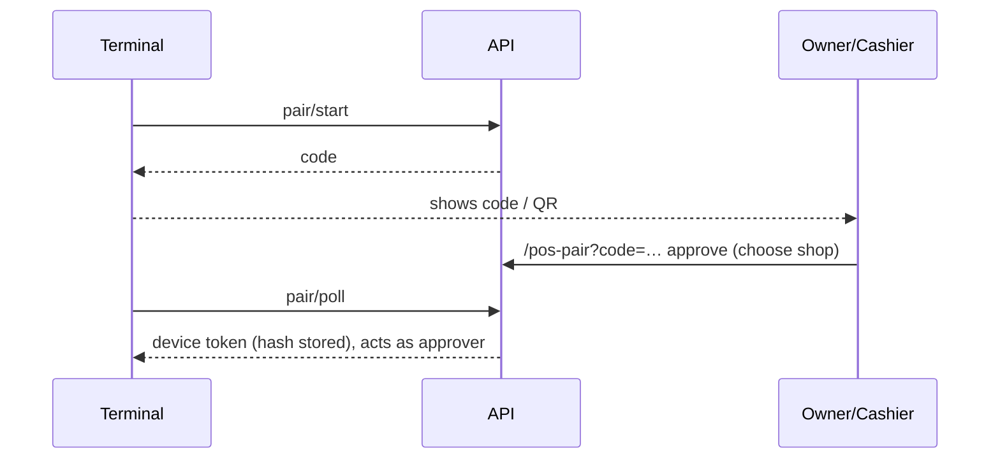
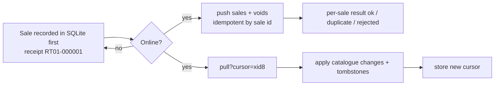

# 11 · POS desktop offline sync (module `pos_sync`)

**Where:** `commerce/src/modules/pos_sync/{pairing,sync}.rs` · migration `0016_pos_sync` · layer `frontend/layers/pos-sync` (`/pos-pair`, `/dashboard/pos-devices`) · app `pos-desktop/` (Tauri 2 + Nuxt 4 + SQLite).

## Actors
Desktop terminal · owner/cashier who approves pairing · owner (revokes).

## Entry points
| Action | API |
|---|---|
| Pairing | `POST /pos/pair/start` · `POST /pos/pair/poll` · `GET /pos/pair/:code` · `POST /pos/pair/approve` |
| Devices | `GET /shops/:id/pos-devices` · `POST /shops/:id/pos-devices/:device_id/revoke` |
| Device (device token) | `GET /pos/device/me` · `GET /pos/device/pull?cursor=` · `POST /pos/device/push {sales, voids}` |

## Pairing

## Sync loop

## Flow
1. Pair the terminal (above); it appears at `/dashboard/pos-devices`.
2. Initial pull downloads the catalogue to SQLite.
3. Sell, print, void offline; numbers are per terminal and gap-free → final even offline.
4. When online: push (idempotent), then pull from cursor.
5. Owner can revoke a terminal → token stops working.

## Rules
- Offline sales are always accepted; if stock ran out, stock stops at 0 and missing units go to `pos_sales.stock_shortfall`. Void returns only what was actually taken.
- Pull uses PostgreSQL `xid8` cursor + tombstones → late commits and deletes are never missed.
- `pos_sales.origin = device`.
- Printing: ESC/POS over IP, Windows spooler or CUPS; bitmap receipts for Lao/Thai; drawer kick.
- Promotions aren't applied offline yet.
- Installers: `.github/workflows/pos-desktop.yml` on tag `pos-v*`.

## Config
`POS_SYNC_ENABLED` (default on).

## Test
`python scripts/pos_sync_test.py` · `cd pos-desktop/src-tauri && ZK_API=http://localhost:8080/api cargo test --test offline_sync`.
