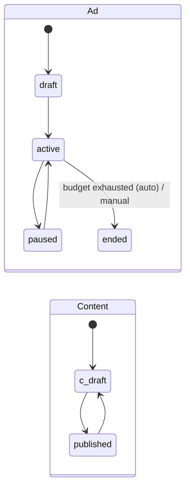
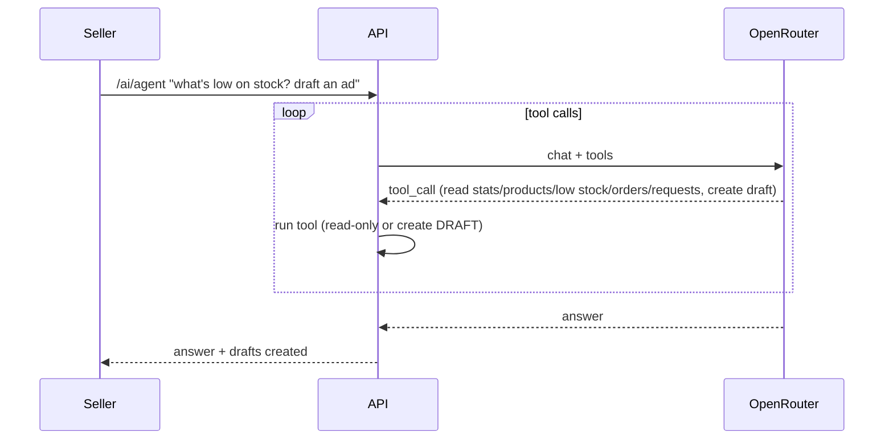

# 12 · Ads, creator content & AI

**Where:** `commerce/src/routes/{ads,content,ai_routes}.rs`, `commerce/src/ai.rs` · pages `/dashboard/ads`, `/dashboard/content`, `/dashboard/assistant`, `/feed`.

## Actors
Seller / creator (perm `marketing`) · shopper · OpenRouter model.

## Entry points
| Action | API |
|---|---|
| Ads | `GET\|POST /shops/:id/ads` · `PATCH /ads/:id` · `GET /ads/serve` · `POST /ads/:id/click` |
| Content | `GET\|POST /shops/:id/contents` · `PATCH\|DELETE /contents/:id` · `GET /feed/contents` |
| AI | `GET /ai/status` · `POST /shops/:id/ai/generate` · `POST /shops/:id/ai/agent` |

## States

## Ads flow (CPC)
1. Create campaign on own or resold product: headline, body, image, `budget_cents`, `cpc_cents` (default 100), dates.
2. Activate. `/ads/serve` picks active campaigns whose product is active + approved + in stock and `spent + cpc ≤ budget`, weighted by CPC; records impressions.
3. `/ads/:id/click` charges CPC; ends the campaign when the next click wouldn't fit the budget.

## Content flow
1. Creator writes (or AI drafts) a post, caption, video script, description or ad copy, optionally linked to a product.
2. Publish → appears in `/feed` with a shoppable link that credits the creator's shop as reseller ([06](06-sell-staff.md)).

## AI flow

- `generate`: content for a product in any tone/language, optionally saved as draft.
- `agent`: tool-using assistant; **never publishes or spends money** — only drafts.
- Fallbacks: primary `AI_MODEL` → `AI_FALLBACK_MODELS` in order; 429/overload retried (`AI_MAX_RETRIES`, honours `Retry-After`); still busy → offline templates with `ai: false` (unless `AI_OFFLINE_ON_BUSY=false`). No key → offline templates.

## Config
`OPENROUTER_API_KEY`, `OPENROUTER_BASE_URL`, `AI_MODEL`, `AI_FALLBACK_MODELS` (keep a paid model last), `AI_MAX_RETRIES`, `AI_OFFLINE_ON_BUSY`.

## Gaps (production checklist)
Ad-click fraud dedupe per visitor/IP; rate limiting on click endpoint.
