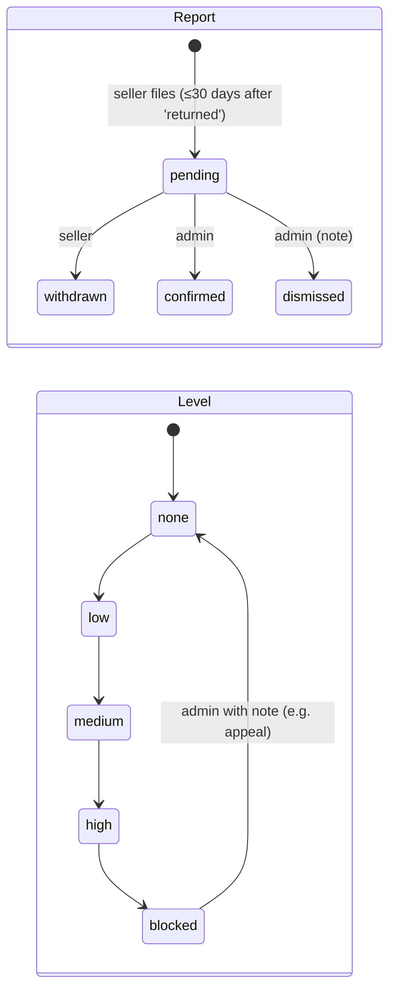

# 13 · COD risk (module `cod_risk`)

**Where:** `commerce/src/modules/cod_risk/{seller,admin,risk,chain}.rs` · migration `0013_cod_risk` · layer `frontend/layers/cod-risk` (`/dashboard/cod-risk`, `/admin/cod-risk`, `/admin/cod-risk/:key`).

## Actors
Seller (perm `delivery`) · admin · anchoring gateway (blockchain, e.g. MBlock).

## Entry points
| Action | API |
|---|---|
| Seller views | `GET /shops/:id/cod-risk/unshipped\|refused` · `POST /shops/:id/cod-risk/check {phones}` |
| Reports | `GET\|POST /shops/:id/cod-risk/reports` · `POST /cod-risk/reports/:id/withdraw` |
| Admin | `GET /admin/cod-risk/overview` · `GET /admin/cod-risk/reports?status=&q=` · `POST /admin/cod-risk/reports/:id/decision {confirm\|dismiss, note, level?, expires_days?}` |
| Customers | `GET /admin/cod-risk/customers?level=&q=` · `GET …/customers/:key` · `POST …/:key/level {level, note, expires_days?}` |
| Chain | `GET /admin/cod-risk/chain` · `POST /admin/cod-risk/chain/anchor` · `GET /admin/cod-risk/proof/:height` |

## States

(Admin can set any level directly, with reason and optional expiry.)

## Flow
1. Parcel marked `returned` in COD ledger ([08](08-delivery-cod.md)).
2. Seller files a report from *Refused parcels*: reason (`refused, unreachable, fake_address, no_show, changed_mind, other`) + note. One per order.
3. Admin reviews queue → customer page shows all reports, stats, **suggested** level, ledger history.
4. Admin confirms/dismisses and sets level. Suggestion: 1 confirmed = low; 2 or 2 shops = medium; 3 or 2 in 90 days = high; 5 or 3 shops = blocked. API never sets it automatically.
5. Before shipping, sellers see each COD order's level (*Before you ship*) and can check numbers.
6. Checkout & `/c/:token` refuse COD at/above `COD_RISK_BLOCK_COD_AT`; online pay still works.

## Ledger & anchoring
```mermaid
flowchart LR
  E[filing / withdraw / decision / level] -->|same txn| B[block: sha256(height|prev|ts|event|payload)]
  B --> T[(append-only table, trigger blocks UPDATE/DELETE)]
  T -->|every N secs or Anchor now| M[Merkle root of unanchored blocks]
  M -->|POST + X-Signature HMAC| G[Anchor gateway]
  G -->|{tx}| T
```
- Payload has keys, ids, amounts, note hashes — no personal data.
- `/admin/cod-risk` re-verifies the whole chain and points at the first broken block.
- `/proof/:height` returns block + batch + Merkle path for independent verification.

## Rules
- Customer key = `HMAC-SHA256(COD_RISK_PEPPER, E.164 phone)` → same person across formats and shops.
- Sellers see only level + counts, never other shops' names/notes.
- **Never change `COD_RISK_PEPPER`** in production.

## Config
`COD_RISK_ENABLED`, `COD_RISK_PEPPER`, `COD_RISK_REPORT_WINDOW_DAYS` (30), `COD_RISK_BLOCK_COD_AT` (blocked), `COD_RISK_ANCHOR=webhook`, `COD_RISK_ANCHOR_URL`, `COD_RISK_ANCHOR_SECRET`, `COD_RISK_ANCHOR_EVERY_SECS`, `COD_RISK_LEDGER_NAME`.

## Test
`python scripts/mock_anchor.py &` → API with anchor env → `python scripts/cod_risk_test.py` (+ `PGURL=…` to test edit refusal).
