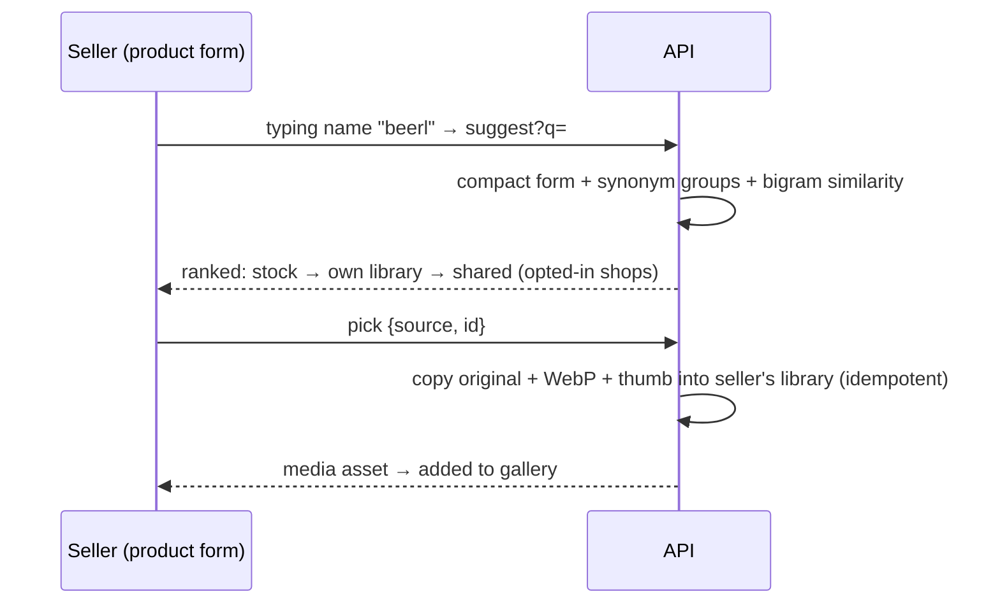

# 14 · Image suggestions (module `image_suggest`)

**Where:** `commerce/src/modules/image_suggest/{seller,admin,store,text}.rs` · migration `0014_image_suggest` · layer `frontend/layers/image-suggest` · slots `gallery.suggest`, `media.library` · page `/admin/stock-images`.

## Actors
Seller (perm `products`/`media`) · admin · opted-in shops (shared photos).

## Entry points
| Action | API |
|---|---|
| Suggest / pick | `GET /shops/:id/image-suggest?q=&category_id=&limit=` · `POST /shops/:id/image-suggest/pick {source: stock\|own\|shared, id, query}` |
| Sharing opt-in | `GET\|PUT /shops/:id/image-suggest/sharing {share}` |
| Stock library | `GET\|POST /admin/image-suggest/stock` · `POST …/stock/promote` · `PATCH\|DELETE …/stock/:id` · `GET /admin/image-suggest/candidates?q=` |
| Synonyms | `GET\|POST /admin/image-suggest/synonyms {terms}` · `DELETE …/synonyms/:id` |

## Flow

1. Seller types the product name; gallery shows matches live.
2. Ranking: stock first (popular higher), then own, then shared; matching marketplace category adds a little.
3. Pick copies the photo into the seller's library — independent asset (alt text, order, delete as usual). Picking twice returns the same copy.
4. Admin curates stock (title, multilingual keywords, brand, credit), promotes shop photos with permission, edits/hides/deletes, manages synonyms (`beer lao = beerlao = ເບຍລາວ = เบียร์ลาว`).

## Rules
- Lao/Thai matching without word spaces: lowercase, strip spaces/punctuation, substring tests.
- Shared source only from shops that opted in (off by default) and only live, approved product photos; copies are never re-suggested under another shop's name.
- Deleting original or copy never affects the other; hiding stock doesn't remove shop copies.

## Config
`IMAGE_SUGGEST_ENABLED`, `IMAGE_SUGGEST_SHARED`.

## Test
`python scripts/image_suggest_test.py`.
