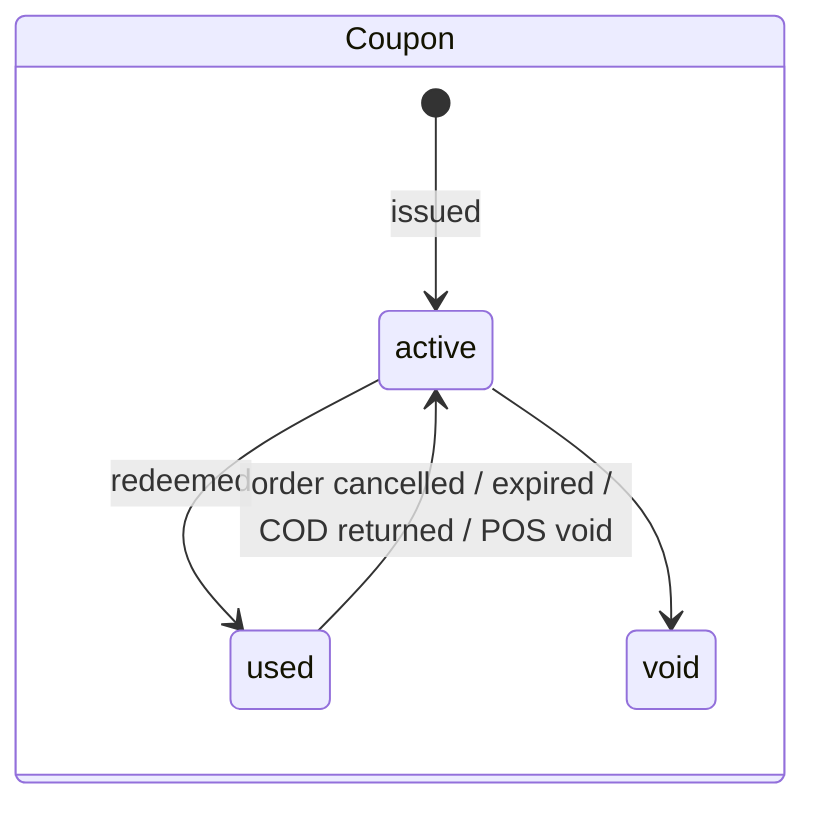

# 15 · Promotions & loyalty (module `promo`)

**Where:** `commerce/src/modules/promo/{campaigns,engine,loyalty,customer}.rs` · migration `0018_promo` · layer `frontend/layers/promo` (`/admin/promotions`, `/dashboard/promotions`, `/dashboard/loyalty`, `/rewards`).

## Actors
Admin (platform campaigns) · shop (perm `marketing`) · customer · cashier.

## Entry points
| Action | API |
|---|---|
| Shop campaigns | `GET\|POST /shops/:id/promo/campaigns` · `PATCH /promo/campaigns/:id` |
| Platform campaigns | `GET\|POST /admin/promo/campaigns` · `PATCH /admin/promo/campaigns/:id` · `GET /admin/promo/liability` |
| Loyalty | `GET\|PUT /shops/:id/loyalty` · `GET …/loyalty/members?q=` · `GET …/members/:member` · `POST …/:member/adjust {delta, note}` · `GET …/loyalty/lookup?phone=` · `POST …/loyalty/quote` |
| Customer | `GET /me/rewards` · `POST /promo/quote` · `POST /public/social-orders/:token/promo` |
| Apply | checkout / social confirm / POS sale accept `promo: {code, points}` (cart `points: {shop_id: n}`, POS `member_phone`) |

## Campaign types
| Owner | Trigger | Reward |
|---|---|---|
| Platform | `signup` (by login method) → personal coupon via background job · `code` | amount / percent (capped) / free shipping |
| Shop | `first_order` (after first completed sale) → coupon or bonus points · `code` (e.g. `LIVE10`, once per customer) | amount / percent / free shipping / points |

Constraints: min spend, validity days, budget (max rewards), start/end, channels (web, chat, POS).

## States

Loyalty ledger reasons (append-only): `earn · redeem · bonus · adjust · reverse · expire`.

## Flow
1. Admin/shop creates a campaign; signup coupons are handed out by job every `PROMO_JOB_SECS`.
2. Customer applies at cart (code + points per shop; platform coupon goes to the largest order it fits), `/c/:token` (code; points only when signed in with WhatsApp on that phone), or POS (cashier looks up phone, taps coupon, uses points).
3. Discount treated as bill discount; VAT on net.
4. Points earned on goods after discounts when web/chat sale completes or at the till.
5. Reversal on cancel/expire/COD returned/void: coupon & spent points returned, earned points taken back.
6. Platform-funded discounts stored in `platform_discount_cents`; still the shop's taxable sale; liability page lists what the platform owes each shop.

## Rules
- Member = E.164 phone → web, chat and POS purchases accumulate together.
- Loyalty settings: earn rate, point value, min per use, max % of bill, expiry after inactivity.
- Offline desktop POS doesn't apply promotions yet.

## Config
`PROMO_ENABLED`, `PROMO_JOB_SECS` (60).

## Test
`python scripts/promo_test.py` (with `ADMIN_EMAILS`, `PROMO_JOB_SECS=1`, WhatsApp env, `mock_graph.py`).
