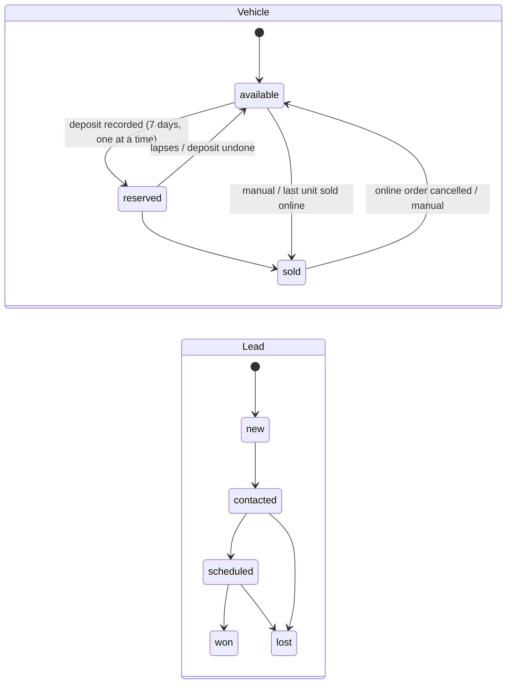

# 16 · Vehicle dealers (core `vehicle`)

**Where:** `backend/crates/vehicle/src/{lib,vehicles}.rs` (implements `ListingExt`) · migration `0010_vehicles` · layer `frontend/layers/vehicle` (`/vehicles`, showroom `/s/:slug`, `/dashboard/leads`).

## Actors
Dealer (`vertical = vehicle`, perm `leads`/`products`) · buyer (no account) · broker (sell-staff reseller).

## Entry points
| Action | API |
|---|---|
| Search | `GET /vehicles?shop=&type=&make=&model=&year_min=&year_max=&price_min=&price_max=&km_max=&fuel=&transmission=&condition=&body=&q=&sort=` (items, total, facets) |
| Spec sheet | `GET\|PUT /products/:id/vehicle` · `POST /products/:id/vehicle/status` |
| Buyer request | `POST /catalog/products/:id/leads` |
| Leads | `GET /shops/:id/leads` · `PATCH /leads/:id` |

## States

## Flow
1. Dealer creates a product with "Vehicle details": type, condition, make (canonicalised), model, variant, year, mileage, fuel, transmission, body, drive, cc, power, seats, doors, colour, owners, registration, location, features, warranty; private plate & VIN. Title suggested ("2020 Toyota Hilux Revo 2.4 E").
2. Selling terms: deposit amount, negotiable, finance available, allow buying online.
3. Product goes through normal review ([04](04-products.md)).
4. Buyer finds it at `/vehicles` or the showroom (filters in URL), opens listing: specs, Call/WhatsApp, loan calculator, request form (`enquiry, test_drive, offer, reserve, finance`).
5. Lead lands in `/dashboard/leads`; dealer calls/WhatsApps, sets appointment & notes, moves status, records/undoes deposit, marks sold/available.
6. Sold vehicles stay listed 7 days with "Sold" badge, sort last, accept no requests.

## Rules
- Commerce never imports vehicle — specs are attached through `ListingExt`.
- Public page shows only last 4 VIN chars.
- Checkout refuses vehicles unless buy-online and available.
- Lead spam: repeats within 10 min merged; 5 requests/hour per phone. Lao numbers accepted.
- Broker storefronts show resold vehicles; requests go to the broker.

## Test
`python scripts/vehicle_test.py` (`ADMIN_EMAILS=admin@demo.dev`).
