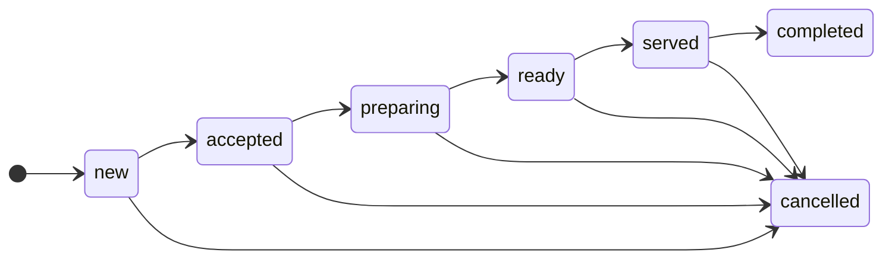

# 17 · Restaurant (core `restaurant`)

**Where:** `backend/crates/restaurant/src/{lib,routes}.rs` · schema `restaurant.*` (migration `2001_restaurant`) · layer `frontend/layers/restaurant` (`/food`, menu on `/s/:slug`, table QR `/r/t/<token>`, tracking `/r/o/<token>`, `/dashboard/restaurant/{menu,tables,orders,settings}`).

## Actors
Restaurant owner/staff (perms `products` menu, `settings` tables, `orders` kitchen) · diner (no account needed).

## Entry points
| Action | API |
|---|---|
| Discover | `GET /restaurant/places` |
| Menu / order | `GET /restaurant/menu/:slug` · `POST /restaurant/menu/:slug/orders` · `GET /restaurant/tables/:token` |
| Track | `GET /restaurant/track/:token` |
| Settings | `GET\|PUT /shops/:id/restaurant` |
| Menu & tables | `POST /shops/:id/restaurant/{sections,items,tables}` · `PATCH\|DELETE /restaurant/{sections,items,tables}/:id` |
| Kitchen | `GET /shops/:id/restaurant/orders?view=active\|done\|all` · `PATCH /restaurant/orders/:id {status?, paid?, payment_method?}` |

## States (`restaurant.orders.status`)

Any **later** step can be chosen directly (e.g. `new → preparing`, `ready → completed`); never backwards; `completed`/`cancelled` are final.

## Flow
1. **Setup:** settings (accepting orders, dine-in/takeaway/delivery — at least one, service charge ≤30%, prep minutes); sections & items (EN/LO names, price, image, spicy 0–3, available); tables (label, seats) → each gets a QR token `/r/t/<token>` (rotate to invalidate printed codes).
2. **Order:** diner scans table QR (dine-in, table preset) or opens menu for takeaway/delivery (address required for delivery); enters name/phone, item notes.
3. API creates order with daily ticket number (shop-local day, UTC+7), subtotal + service charge, and a tracking token.
4. Diner follows `/r/o/<token>`.
5. **Kitchen board** shows active orders (not completed/cancelled, plus completed-but-unpaid); staff move statuses.
6. Staff mark paid with method `cash|transfer|card`; cancelled orders can't be marked paid.

## Rules
- Ticket numbers unique per shop per day.
- Phone accepts local (`020 5555 1234`) or international, 8–15 digits.
- `TaxSource`: paid, non-cancelled orders by day → finance ([19](19-finance-tax.md)).
- Tables are dine-in only; delivery requires an address.

## Test
`python scripts/superapp_test.py` (demo `khao@demo.dev`, "Khao Niew Kitchen").
