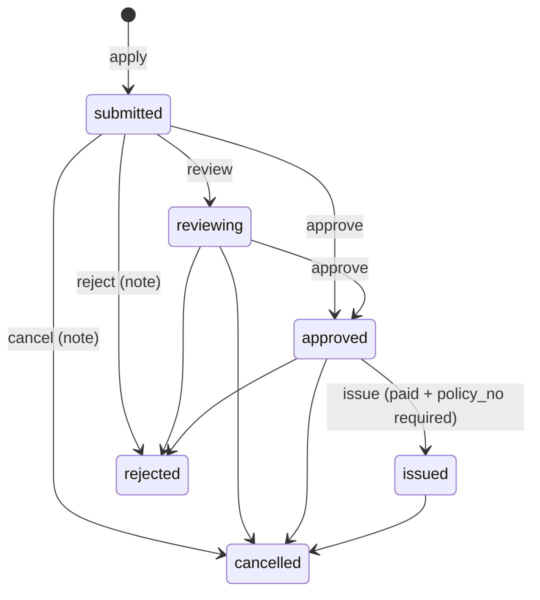

# 18 · Insurance (core `insurance`)

**Where:** `backend/crates/insurance/src/{lib,routes}.rs` · schema `insurance.*` (migration `3001_insurance`) · layer `frontend/layers/insurance` (`/insurance`, `/insurance/:id` quote/apply, `/insurance/my`, `/dashboard/insurance/{plans,applications}`).

## Actors
Insurance agent/broker shop · customer (signed in or not) · insurer (offline — issues policy number).

## Entry points
| Action | API |
|---|---|
| Browse | `GET /insurance/plans` · `GET /insurance/plans/:id` |
| Quote / apply | `POST /insurance/plans/:id/quote` · `POST /insurance/plans/:id/apply` |
| My applications | `GET /me/insurance` |
| Agent plans | `GET\|POST /shops/:id/insurance/plans` · `PATCH /insurance/plans/:id` |
| Agent applications | `GET /shops/:id/insurance/applications` · `POST /insurance/applications/:id/decision {action, note, policy_no}` |

## States (`insurance.applications.status`)

`paid` / `unpaid` are separate actions toggling `paid` (not allowed once rejected/cancelled).

## Flow
1. **Agent publishes plans:** kind (`motor, health, travel, life, property, accident, other`), insurer, name EN/LO, coverage list, term months, premium mode:
   - `fixed`: `premium_cents` per term;
   - `rate`: `rate_bps` × sum insured, at least `min_premium_cents`; sum insured within min/max.
2. **Customer quotes:** picks plan, enters sum insured → premium.
3. **Apply:** name, phone, email, kind-specific `details` (plate/make/model for motor, destination & dates for travel …), start date → application number; end date = start + term.
4. **Agent works the queue:** review → approve → collect premium, mark `paid` → place with insurer → `issue` with the insurer's policy number.
5. Reject/cancel require a note shown to the customer.
6. Customer sees status, policy no. and notes at `/insurance/my` (`GET /me/insurance`).

## Rules
- Premium recomputed server-side; sum insured out of range is refused.
- Issue blocked until `paid` and a policy number (≤60 chars) is entered.
- Closed applications (rejected/cancelled) can't change payment state.

## Test
`python scripts/superapp_test.py` (demo `cover@demo.dev`, "Mekong Cover").
