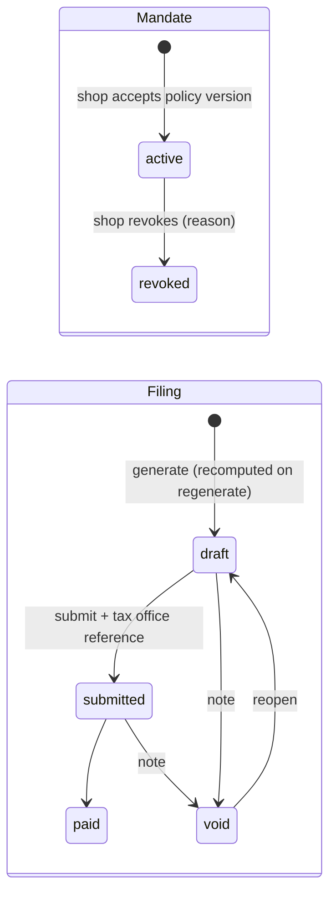
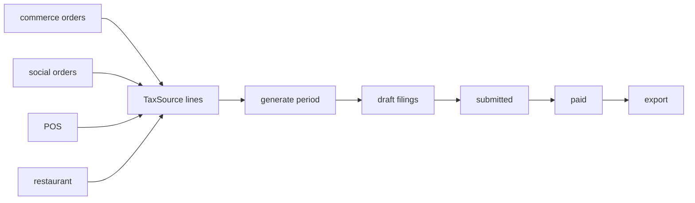

# 19 · Finance — tax agent (core `finance`)

**Where:** `backend/crates/finance/src/{lib,routes,calc}.rs` · schema `finance.*` (migration `4001_finance`) · `TaxSource` impls in `commerce/src/tax.rs` and `restaurant/src/lib.rs` · pages `/dashboard/tax`, `/admin/tax`.

## Actors
Shop owner (signs mandate) · platform owner/admin (tax agent) · Lao Tax Department (offline).

## Entry points
| Action | API |
|---|---|
| Policy | `GET /finance/policy` |
| Shop view / mandate | `GET /shops/:id/finance` · `POST /shops/:id/finance/mandate` · `POST /shops/:id/finance/mandate/revoke` |
| Admin settings | `GET\|PUT /admin/finance/settings` |
| Filings | `GET /admin/finance/filings` · `POST /admin/finance/filings/generate` · `GET /admin/finance/filings/export` (CSV) · `PUT /admin/finance/filings/:id {action, reference_no, note}` |

## States

## Flow
1. **Admin config** (`/admin/tax`): VAT bps, e-commerce tax bps, due day (1–28 of next month), tax office, agent name & tax ID, policy text EN/LO + version.
2. **Shop mandate** (`/dashboard/tax`): requires tax ID (and approved KYB if business); signer name/title, VAT-registered flag → accepts current policy version.
3. **Month end — generate** for a period: for each active-mandate shop, collect completed sales from every `TaxSource`:
   - commerce online orders (`paid/shipped/completed`, goods − discounts),
   - social orders (`paid/shipped/completed`),
   - POS sales (`completed`),
   - restaurant orders (paid, not cancelled).
4. **Compute** per shop & currency: gross → if VAT-registered, VAT taken out of VAT-inclusive gross → net; e-commerce tax on net; total due; `due_on`. Sources breakdown stored in `sources` JSON.
5. **Submit** each filing with the tax-office reference → **paid** when settled → **export CSV**.
6. Every action logged in `finance.events`.

## Rules
- Only `draft` filings are recomputed; submitted/paid/void are never touched.
- Unique per (period, shop, currency); period is the 1st of the month.
- Rates are snapshotted on the filing.
- Platform-funded promo discounts still count as the shop's taxable sale ([15](15-promo.md)).
- **Default rates are placeholders — confirm current Lao rates with the Tax Department before going live.**

## Test
`python scripts/superapp_test.py` (uses `psql` to backdate sales; Siam Crafts has a mandate).
