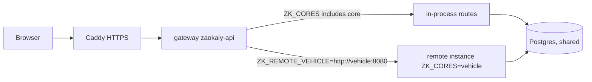

# 20 · Gateway & core registry

**Where:** `backend/crates/gateway/src/{main,proxy}.rs` (binary `zaokaiy-api`), `backend/crates/kernel/src/core.rs` · front-end `frontend/app` (`useCores`, `registerCore` in each layer's `plugins/core.ts`).

## Actors
Ops (deploy/config) · every request · each core.

## Entry points
`GET /api/cores` (enabled cores + where each runs) · `GET /api/modules` (plug-in modules on/off).

## Request routing

## Startup flow
1. Load config; run migrations (kernel 0001–0999 baseline, then each enabled core: 2001 restaurant, 3001 insurance, 4001 finance).
2. Promote `ADMIN_EMAILS`; start background jobs (media backfill, social expiry, promo, COD-risk anchor …) for enabled modules.
3. Build the **registry** from `ZK_CORES` (default `all`): each core contributes
   - `Routes` (paths remembered for proxying),
   - `ListingExt` (vehicle → commerce listings),
   - `ShopHook` (KYB revoked → commerce pauses products),
   - `TaxSource` (sales for finance),
   - `access_rules` (route → staff permission).
4. Paths of cores configured as `ZK_REMOTE_<CORE>` are streamed to that instance.
5. Front end reads `/api/cores` and hides layers whose core isn't running; each layer registers home tile/section, dashboard/admin nav, onboarding choice, storefront per shop type, overview, product renderer.

## Splitting a core out
1. Run another instance with `ZK_CORES=vehicle` (same `DATABASE_URL`, same `JWT_SECRET`).
2. On the main gateway set `ZK_REMOTE_VEHICLE=http://vehicle:8080`.
3. Each instance checks the JWT itself. Cores with their own Postgres schema (`restaurant`, `insurance`, `finance`) can later move to their own database.

## Plug-in module pattern
- Backend: `commerce/src/modules/<name>/` + one migration; hooks only via `modules/mod.rs` (routes, jobs, translations) and one-line checkout hooks. `<NAME>_ENABLED=false` → routes 404, hooks no-op.
- Frontend: `frontend/layers/<name>/` auto-loaded; menu via `zkModules` in `app.config.ts`; UI inside core screens via `<ModuleSlot name="…">` + `*.global.vue`.

## Rules
- Every error message must have a Lao translation — `crates/gateway/tests` fails otherwise.
- Remote cores share DB + `JWT_SECRET`.

## Deploy
See `DEPLOY.md` / project doc `deploy-hostinger.md`: `docker-compose.prod.yml` + Caddy, `.env.prod`, backups (include `KYC_ENCRYPTION_KEY` separately).
