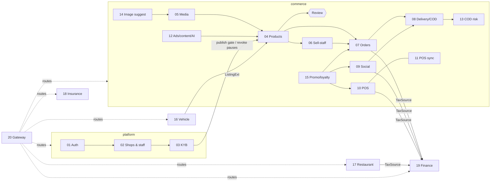

# zaokaiy — module workflows

One file per module: who does what, in which order, which states a record moves through, and the rules the server enforces. Diagrams are Mermaid (render on GitHub/GitLab and in VS Code with a Mermaid extension).

Each file follows the same layout: **Where it lives → Actors → Entry points → States → Flow → Rules → Config → Test**.

## Index

| # | Module | Core / crate | Front-end | Switch |
|---|---|---|---|---|
| 01 | [Accounts & sign-in](01-auth.md) (password, Google/Facebook, WhatsApp OTP, 2FA, captcha) | platform | `app/` | — |
| 02 | [Shops, onboarding & staff](02-shops-staff.md) | platform | `app/` | — |
| 03 | [Business verification (KYB)](03-kyb.md) | platform | `app/` | `KYB_REQUIRED_TO_PUBLISH` |
| 04 | [Products, categories, review & inventory](04-products.md) | commerce | `layers/commerce` | `PRODUCT_REVIEW` |
| 05 | [Media library](05-media.md) | commerce + kernel | `layers/commerce` | — |
| 06 | [Sell-staff network & commissions](06-sell-staff.md) | commerce | `layers/commerce` | — |
| 07 | [Cart, checkout & orders](07-orders.md) | commerce | `layers/commerce` | — |
| 08 | [Delivery & COD ledger](08-delivery-cod.md) | commerce | `layers/commerce` | — |
| 09 | [Social selling (comment → order)](09-social.md) | commerce | `layers/commerce` | — |
| 10 | [POS (web till, bills, barcodes, printing)](10-pos.md) | commerce | `layers/commerce` | — |
| 11 | [POS desktop offline sync](11-pos-sync.md) | commerce module `pos_sync` | `layers/pos-sync`, `pos-desktop/` | `POS_SYNC_ENABLED` |
| 12 | [Ads, creator content & AI](12-ads-content-ai.md) | commerce | `layers/commerce` | `OPENROUTER_API_KEY` |
| 13 | [COD risk](13-cod-risk.md) | commerce module `cod_risk` | `layers/cod-risk` | `COD_RISK_ENABLED` |
| 14 | [Image suggestions](14-image-suggest.md) | commerce module `image_suggest` | `layers/image-suggest` | `IMAGE_SUGGEST_ENABLED` |
| 15 | [Promotions & loyalty](15-promo.md) | commerce module `promo` | `layers/promo` | `PROMO_ENABLED` |
| 16 | [Vehicle dealers](16-vehicle.md) | vehicle | `layers/vehicle` | `ZK_CORES` |
| 17 | [Restaurant](17-restaurant.md) | restaurant | `layers/restaurant` | `ZK_CORES` |
| 18 | [Insurance](18-insurance.md) | insurance | `layers/insurance` | `ZK_CORES` |
| 19 | [Finance — tax agent](19-finance-tax.md) | finance | `layers/finance` | `ZK_CORES` |
| 20 | [Gateway & core registry](20-gateway.md) | kernel + gateway | `app/` (useCores) | `ZK_CORES`, `ZK_REMOTE_*` |

## How the modules connect

## Shared conventions

- **Money** is integer minor units (`*_cents`); rates are basis points (`*_bps`, 1000 = 10%).
- **Stock** changes only inside a transaction and always writes an `inventory_movements` row (`restock · sale · adjust · return · cancel · reserve · release`).
- **Permissions** are enforced on the server (`kernel/src/access.rs`). Routes missing from the table are owner-only.
- **Audit trails**: `product_reviews`, `kyb_events`, `finance.events`, COD-risk hash chain, `loyalty_ledger`.
- **Errors** are translated to Lao when the request has `Accept-Language: lo`; the gateway test fails if any message lacks a translation.
- **Admins** are the emails in `ADMIN_EMAILS`, re-checked against the DB on every admin request.
